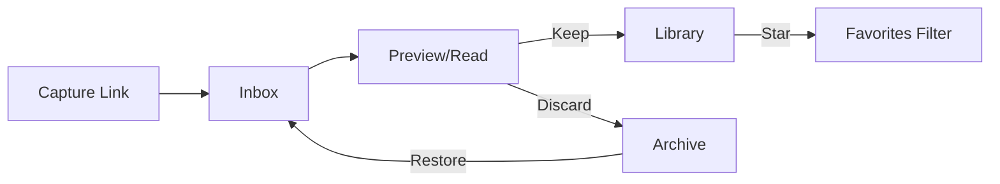

# Inbox-Library UX Architecture Overhaul

**Date:** January 3, 2026
**Branch:** `feature/inbox-library-ux`
**Status:** Complete (pending testing and production migration)

## Summary

Transform Portable from a folder-based bookmarking app into a **triage-focused consumption tool**:



---

## Data Model Changes

Add triage columns to track state and enable smart sorting:

| Bucket  | Condition                                 | Sort By       |
| ------- | ----------------------------------------- | ------------- |
| Inbox   | `is_kept = false AND is_archived = false` | `created_at`  |
| Library | `is_kept = true AND is_archived = false`  | `kept_at`     |
| Archive | `is_archived = true`                      | `archived_at` |

**Migration:** `supabase/migrations/`

- Add `is_kept BOOLEAN DEFAULT false` column
- Add `kept_at TIMESTAMPTZ` column (set when item is moved to Library)
- Add `archived_at TIMESTAMPTZ` column (set when item is archived)
- Remove `is_later` column (deprecated)
- Keep `is_favorite` for starring within Library
- Keep `is_archived` for soft-delete

**Update types:** `src/lib/types.ts`

- Add `is_kept: boolean` to Item interface
- Remove `is_later`

---

## Navigation Changes

**Update:** `src/components/layout/topbar/topbar-nav.tsx`

```
Before: Everything | Later | Favorites
After:  Inbox | Library | Archive
```

Icons: `Inbox` / `BookMarked` / `Archive` from lucide-react

---

## Route Structure

| Route                     | Purpose                                 |
| ------------------------- | --------------------------------------- |
| `/inbox`                  | Default landing, shows un-triaged items |
| `/library`                | Kept items collection                   |
| `/library?favorites=true` | Favorites filter within Library         |
| `/archive`                | Soft-deleted items with restore option  |

**Files to create/modify:**

- Rename `src/app/(protected)/everything/` to `inbox/`
- Create `src/app/(protected)/library/page.tsx`
- Create `src/app/(protected)/archive/page.tsx`
- Remove `src/app/(protected)/later/` and `src/app/(protected)/favorites/`

---

## Reader View (Context-Aware Actions)

**Update:** `src/app/(reader)/items/[id]/item-reader-view.tsx`

The reader view is accessible from **all three buckets**. Header actions adapt based on item state:

| Source Bucket | Header Actions                                 |
| ------------- | ---------------------------------------------- |
| **Inbox**     | `[Keep]` (primary) `[Discard]` (ghost) `[...]` |
| **Library**   | `[Favorite toggle]` `[Archive]` `[...]`        |
| **Archive**   | `[Restore]` `[Delete]` `[...]`                 |

- **After any action:** Stay on item, show toast confirmation
- Pass item state (`is_kept`, `is_archived`) to determine which actions to render
- Keep button uses primary/accent style to encourage triage
- All views retain sidebar with AI summary, topics, and metadata

---

## Server Actions

**Update:** `src/lib/actions/items.ts`

| Action               | Behavior                                                                |
| -------------------- | ----------------------------------------------------------------------- |
| `keepItem(id)`       | Set `is_kept = true` (move to Library)                                  |
| `discardItem(id)`    | Set `is_archived = true` (move to Archive)                              |
| `restoreItem(id)`    | Set `is_archived = false` (back to Inbox or Library based on `is_kept`) |
| Remove `toggleLater` | No longer needed                                                        |

---

## Item Cards Context

**Update:** `src/components/items/item-actions.tsx`

Actions should be context-aware:

- **Inbox items:** Keep, Discard, Copy Link
- **Library items:** Favorite toggle, Archive, Copy Link
- **Archive items:** Restore, Delete permanently

---

## Implementation Order

1. Database migration (add `is_kept`, prepare for `is_later` removal)
2. Update types and server actions
3. Create new route pages (inbox, library, archive)
4. Update navigation component
5. Update reader view with triage actions
6. Update item cards/actions for context awareness
7. Add toast notifications for feedback

---

## Todos

- [x] Create migration: add is_kept column, prepare is_later deprecation
- [x] Update types.ts and items.ts actions (keepItem, discardItem, restoreItem)
- [x] Create /inbox, /library, /archive routes; remove /later, /favorites
- [x] Update topbar-nav.tsx with Inbox/Library/Archive tabs
- [x] Add Keep/Discard buttons to reader view header with toast feedback
- [x] Make ItemActions context-aware (inbox/library/archive modes)
- [x] Remove deprecated code and is_later references
