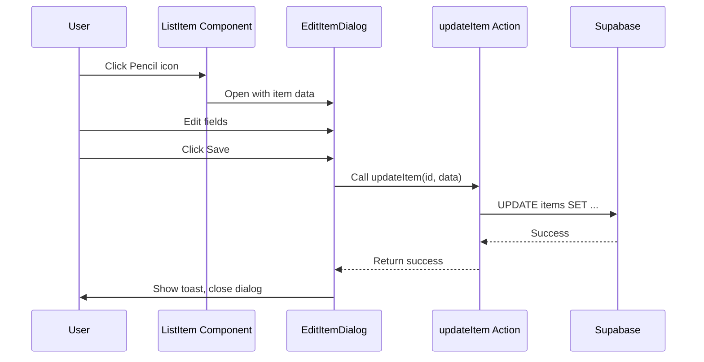

# Edit Bookmark Dialog

## Overview

Add the ability to edit bookmark title, URL, and description via a dialog that opens from the Pencil icon in the list view.

## Implementation Steps

### 1. Add Dialog UI Component

Install the shadcn/ui dialog component:

```bash
npx shadcn@latest add dialog
```

This will create `src/components/ui/dialog.tsx`.

### 2. Create Server Action for Updating Items

Add `updateItem` function to `src/lib/actions/items.ts`:

```typescript
export async function updateItem(
  id: string,
  data: { title?: string; url?: string; description?: string | null }
): Promise<{ success: boolean; message?: string }> {
  const supabase = await createClient();

  const { error } = await supabase.from("items").update(data).eq("id", id);

  if (error) {
    return { success: false, message: error.message };
  }

  revalidateAllPaths();
  return { success: true };
}
```

### 3. Create Edit Item Dialog Component

Create `src/components/items/edit-item-dialog.tsx`:

- Accept `item`, `open`, and `onOpenChange` props
- Form with Input fields for title, URL, and description (textarea)
- Use `updateItem` action on submit
- Show loading state during submission
- Close dialog on success with toast notification

### 4. Integrate Dialog in List View

Update `src/components/items/items-view.tsx`:

- Add state for tracking which item is being edited (`editingItem`)
- Wire up the currently disabled Pencil button to open the dialog
- Render `EditItemDialog` component with the selected item

## Data Flow



## Files Changed

| File | Change |
|------|--------|
| `src/components/ui/dialog.tsx` | New (shadcn component) |
| `src/lib/actions/items.ts` | Add `updateItem` function |
| `src/components/items/edit-item-dialog.tsx` | New component |
| `src/components/items/items-view.tsx` | Add edit state and dialog integration |
